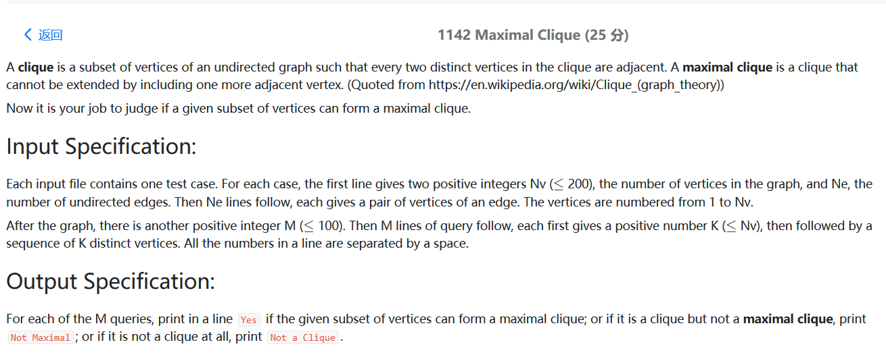
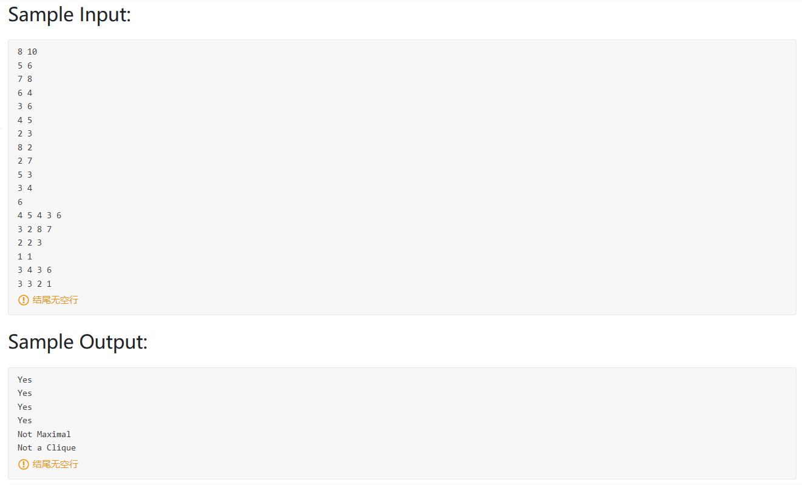
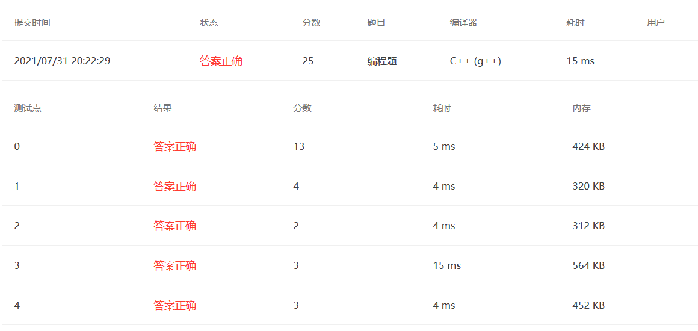

### PAT 1142





题目大意：问题描述：给定一个无向图，和一些顶点，判断这些顶点是否组成了集合（每两个顶点都相连）

Yes 是一个团，每两个顶点都相邻

Not Maximal  是一个团，但是可以再加入一个顶点，使得每两个顶点相连

Not a Clique  不是每两个顶点都相连。

思路：构造邻接矩阵，对给定序列依次判断是否是一个团，然后再尝试加入其他顶点，判断是否是最大团。

```cpp
#include<bits/stdc++.h>
using namespace std;
typedef struct inform{
    string school;
    double total = 0;
    int TWS;
    int number = 0;
}inform;
unordered_map<string,inform> Map;
vector<inform> StuList;
bool cmp(inform a,inform b){
    if(a.TWS==b.TWS && a.number==b.number){
        return a.school<b.school;
    }else if(a.TWS==b.TWS){
        return a.number<b.number;
    }else{
        return a.TWS>b.TWS;
    }
}
int main()
{
    int N;  cin>>N;
    while(N--){   //处理输入
        string id;  int score;  string school;
        cin>>id>>score>>school;
        transform(school.begin(),school.end(),school.begin(),::tolower);  //全转小写
        Map[school].school = school;
        if(id[0]=='B'){
            Map[school].total += double(score)/1.5;
        }else if(id[0]=='A'){
            Map[school].total += score;
        }else if(id[0]=='T'){
            Map[school].total += double(score)*1.5;
        }
        Map[school].number++;
    }
    unordered_map<string,inform>::iterator iter;
    for(iter=Map.begin();iter!=Map.end();iter++){
        iter->second.TWS = iter->second.total;
        StuList.push_back(iter->second);
    }
    sort(StuList.begin(),StuList.end(),cmp);
    int len = StuList.size();
    int rank = 1;
    cout<<StuList.size()<<endl;
    for(int i=1;i<=len;i++){
        if(i-2>=0 && (int)StuList[i-1].total==(int)StuList[i-2].total){}
        else rank = i;
        printf("%d %s %d %d",rank,StuList[i-1].school.c_str(),(int)(StuList[i-1].TWS),StuList[i-1].number);
        if(i!=len) cout<<endl;
    }
    return 0;
}
```



### PAT 1143